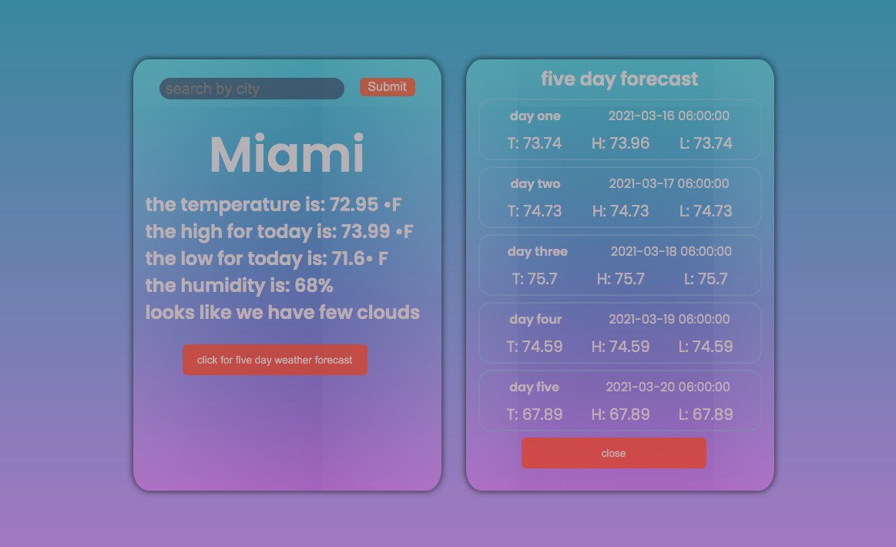
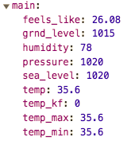

# Weather-App



The main chunk of code used to make this app run is seen below:

```
let cityName = data.name;
    let mainTemp = data.main.temp;
    let lowTemp = data.main.temp_min
    let highTemp = data.main.temp_max
    let mainHumid = data.main.humidity
    let cityOver = data['weather'][0]['description'];
```
I am parsing through OpenWeather's API data for both the current weather which is seen on the left side of the photo as well as the five day forecast that is seen on the right side of the photo.

The syntax seen above is then repeated over like this: 
```
//FIRST DAY IN FIVE DAY
        let dayOneTime = data.list[1].dt_txt
        let dayOneTemp = data.list[1].main.temp
        let dayOneTempHi = data.list[1].main.temp_max
        let dayOneTempLow = data.list[1].main.temp_min
        let dayOneHumid = data.list[1].main.humidity

        dateOne.innerHTML = dayOneTime
        tempOne.innerHTML = 'T: ' + dayOneTemp
        tempHiOne.innerHTML = 'H: ' + dayOneTempHi
        tempLowOne.innerHTML = 'L: ' + dayOneTempLow
````
# Issues



The OpenWeather API appears to have it's fair share of problems, especially for it's free users. In any of the 5 day weather forecast calls it gives it's user the same data for Temp, Temp_Min, and Temp_Max which proved to be pretty frustrating while trying to get the javascript to function properly.

# Final Deployment

https://zane-gilfillan.github.io/Weather-App/


